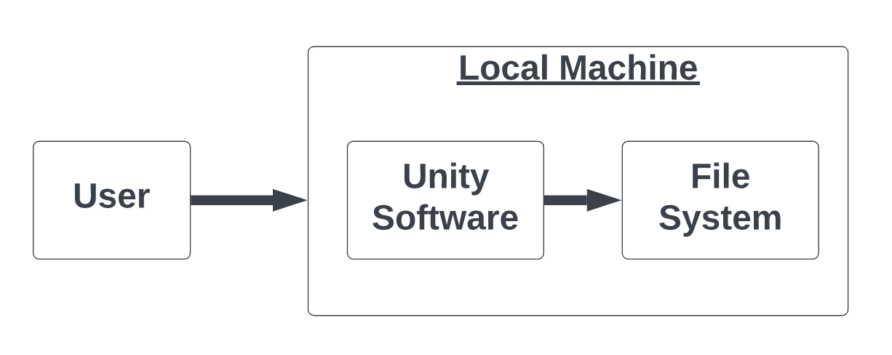

# System Architecture
The system created to display the simulation of an LTN uses the Unity Software game engine in order to do so. It does not communicate with any other services outside of the local machine on which Unity Software is being run, and as such, poses minimal security threats. It also stores no information about the user either locally or remotely. Because of the contained nature of the system, the component diagram is kept relatively simple and is shown here:

## User: 
The user will be a person interacting with the LTN simulation. This could be developers as they test things, the client, or eventually, members of the public in the Royal Albert Memorial Museum (RAMM). These users will only interact with a device on which the LTN simulation is running in Unity, possibly with some help from a more experienced user, such as museum staff/volunteers or a developer.
## Unity Software: 
The Unity Software game engine runs the LTN simulation, in which the user is asked to create an LTN by placing barriers on roads, then a simulation is run with these barriers in place. Some data is collected about the simulation during runtime, such as the total distance travelled by cars. None of this data is from the user, and it is all stored locally in the file system, as seen in the diagram, to be used for displaying results such as the average speed of cars.
## File System: 
The file system is stored on the local machine, and includes a list of current ‘saves’, which are configurations of the LTN that the user has saved. These configurations are currently barrier count and positions. It also contains the previously mentioned information about the simulation from runtime.
## Local Machine: 
Unity Software interacts with the local machine on which it is running by using memory and resources to run the simulation. The local machine contains both Unity Software and the file system, as the file system is stored locally.

## Security Assessment:
We can presume each part of the system to be safe within itself, and expect no problems with any of the components to arise. None of the components communicate with one another using the internet or bluetooth, or any non-local connection. Because of this, the system is self contained on the local machine and is considered safe.
