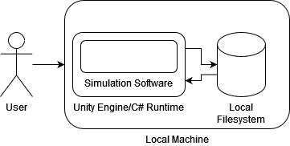

# System Architecture

This document covers the system architecture of the project.

## Diagram and Components

The system architecture is given by the diagram below:

The system architecture consists of the following components:
- A user
- The LTN simulation software
- The Unity engine and C# runtime
- The local filesystem on the machine
- The local machine used to run the software

These are described in further detail below.

## User

The user will be a person interacting with the LTN simulation. This could be the developers as they test things, the client, or eventually, members of the public in the Royal Albert Memorial Museum (RAMM). These users will only interact with a device on which the LTN simulation is running in Unity, possibly with some help from a more experienced user, such as museum staff/volunteers or a developer.

## Simulation Software

The simulation software contains the actual LTN simulation which the user will interact with. This simulation will allow the user to place barriers in a neighbourhood and start the simulation. When the simulation is run, a number of agents are spawned stochastically and travel through the neighbourhood, with data being collected during runtime (e.g. distance travelled, time taken, etc.). This data is presented to the user for analysis both during and after the simulation has completed.

The software is developed and run using the Unity Engine and the C# runtime, which are discussed in more detail below. The software is distributed with the C# runtime and Unity engine bundled into a single software package: the simulation runs on top of these frameworks and allows the user to visualise and interact with the simulation.

## Unity Engine/C# Runtime

The Unity Engine and C# runtime are core components of the project and are the platform on which the simulation is developed and run. These frameworks include many useful features such as a 3D physics and graphical game engine (through Unity) along with a highly performant cross-platform application platform (through the C# runtime), allowing the developers to focus on developing the simuation instead of designing a simulation from scratch. The Unity engine and C# runtime is bundled with the simulation software.

## Local File System

The local file system is stored on the local machine. This file system is used by the simulation software to store information about the simulation including a list of "saves" which specify LTN configurations that the user has created. The simulation software accesses the file system through the C# runtime and saves data in the common JSON format.

## Local Machine

The simulation software runs on a local machine, using hardware resources such as the CPU, memory and storage. The local machine also provides the local file system which the software interacts with to store data about the simulation.

## Security Assessment

We can presume each part of the system to be safe within itself, and expect no problems with any of the components to arise. None of the components communicate with any other component not listed here (e.g. the internet, Bluetooth, etc.). Consequently, the system is self contained on the local machine and is considered safe.
